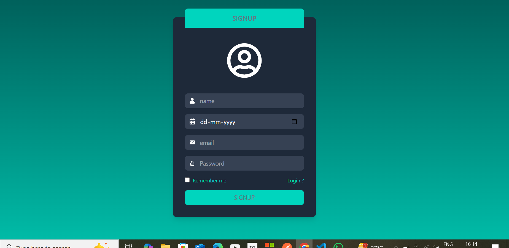

# Full-Stack App (React + Node.js + MongoDB)

This is a full-stack web application using React for the frontend, Node.js/Express for the backend, and MongoDB for data storage.
In this project majore focus on The system allows users to register, log in, and view a protected static table with user information

---

## 📁 Project Structure


///############################/////

---

## 🧰 Tech Stack

- **Frontend**: React
- **Icons**:React-icon
- **Backend**: Node.js, Express
- **Database**: MongoDB
- **Package Manager**: npm
- **Authentication**: JSON Web Token (JWT)
- **Storage**: LocalStorage


#Features of this projects
User Registration
User Login
Protected Route >> datatable
JWT Authentication
LocalStorage for user session management
Responsive layout
---


## ⚙️ Setup & Installation

1. **Clone the repository**

```bash
git clone https://github.com/amit-kumar-72/quantumitinnovationtask.git

cd your-repo-name

////////#################/////////

Install dependencies

For frontend (React):

cd client
npm install

Create a    .env         file in the client/ folder and add:

VITE_BACKEND_URL=http://localhost:port/api/v1


//////########////////
For backend (Node.js/Express):

cd ../api    or cd api     if you are in your parent folder of project
npm install

Create a    .env         file in the api/ folder and add:
in the  .env file

MONGO_URI=your_mongodb_connection_string
PORT=8000

# project mges for overview


